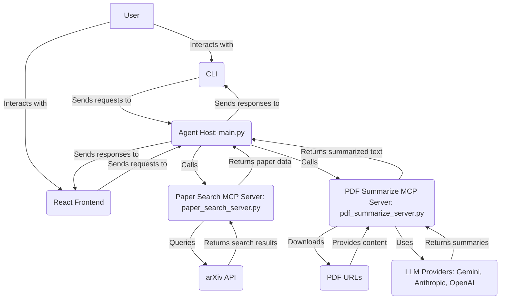

# Scientific Paper Scout Agent

## Project Overview

This project implements a backend system for a "Scientific Paper Scout Agent" application. It allows users to search for scientific papers and summarize PDF documents using various Large Language Models (LLMs). The system is designed with a modular and extensible architecture, supporting different LLM providers and offering both a Command Line Interface (CLI) and a React-based web interface.

## Features

-   **Paper Search**: Search for scientific papers using the arXiv API.
-   **PDF Summarization**: Summarize the content of PDF documents using LLMs.
-   **Streaming**: Supports streaming responses for long-running LLM operations.
-   **Model Agnosticism**: Easily integrate and switch between different LLM providers (e.g., Gemini, Anthropic, OpenAI).
-   **Tool Call Logging**: Logs all tool calls made by the LLM for transparency and debugging.
-   **Modular Architecture**: Clear separation of concerns with dedicated servers for paper search and PDF summarization.
-   **User Interfaces**: Provides both a CLI for quick interactions and a React frontend for a rich user experience.

## Architecture

The project follows a client-server architecture with several key components:

1.  **Agent Host (main.py)**: The central Flask-based backend server that exposes API endpoints for paper search and PDF summarization. It orchestrates calls to the specialized MCP servers and handles LLM interactions.
2.  **Paper Search MCP Server (paper_search_server.py)**: A module responsible for interacting with external paper databases (currently arXiv) and retrieving paper metadata.
3.  **PDF Summarize MCP Server (pdf_summarize_server.py)**: A module responsible for downloading PDFs, extracting text, and summarizing the content using configured LLMs.
4.  **CLI (cli.py)**: A command-line interface for interacting with the Agent Host.
5.  **React Frontend**: A web-based user interface for a more interactive experience.



## Setup and Installation
Follow these steps to set up and run the project locally.

### Prerequisites
Before you begin, ensure you have the following installed:

- Python 3.8+ : For the backend services.
- Node.js and npm (or Yarn) : For the React frontend.
- Git : For cloning the repository.

### 1. Clone the Repository
First, clone the project repository to your local machine:
```bash
git clone https://github.com/varshabhaskar07/KairosAssignment.git
cd KairosAssignment
```

### 2. Backend Setup
Navigate into the backend directory, create a virtual environment, install dependencies, and set up environment variables.
```bash
cd kairos-take-home-0
python -m venv venv
```

On Windows:
```bash
.env\Scriptsctivate
```

On macOS/Linux:
```bash
source venv/bin/activate
```

Install the required Python packages:
```bash
pip install -r requirements.txt
```

Create a `.env` file in the `kairos-take-home-0` directory and add your API keys:
```
GEMINI_API_KEY=YOUR_GEMINI_API_KEY
ANTHROPIC_API_KEY=YOUR_ANTHROPIC_API_KEY
OPENAI_API_KEY=YOUR_OPENAI_API_KEY
```

### 3. Frontend Setup
Navigate into the frontend directory and install its dependencies.
```bash
cd ../frontend
npm install # or yarn install
```

## How to Run

### 1. Run the Backend
```bash
cd d:/KairosAssignment/kairos-take-home-0
.env\Scriptsctivate # On Windows
# source venv/bin/activate # On macOS/Linux
python main.py
```
The backend server will start, typically on http://localhost:5000.

### 2. Run the CLI (Optional)
```bash
cd d:/KairosAssignment/kairos-take-home-0
.env\Scriptsctivate # On Windows
# source venv/bin/activate # On macOS/Linux
python cli.py
```

### 3. Run the Frontend
```bash
cd d:/KairosAssignment/frontend
npm run dev # or yarn dev
```
The frontend will typically be available at http://localhost:5173 (or similar).

## Model Agnosticism Implementation
The project achieves model agnosticism through a modular design where different LLM providers can be integrated by implementing a common interface. The `pdf_summarize_server.py` is designed to dynamically load and use different LLM models based on configuration, allowing for easy switching between Gemini, Anthropic, OpenAI, or other future models without significant code changes to the core logic.

## Contributing
We welcome contributions to the Scientific Paper Scout Agent! Please feel free to submit issues, fork the repository, and send pull requests.

## License
This project is licensed under the MIT License - see the LICENSE file for details.
